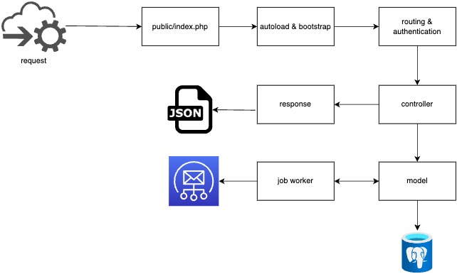

# Levart Code Challenge
This is repository of Levart Coding Test

## Run local
The easiest way to run this application is using docker, because you don't need to install postgres and mailpit, for local installation assume you already install postgresql 16 and mailpit so you can run this application
- Requirement `php 8.2`
- Required `postgresql 16`
- Required `mailpit` for email testing
- Clone this repository
- Change directory to repository
- Copy .env.example
```bash
cp .env.example .env
```
- Install dependencies
```bash
composer install
```
- Database migration
```bash
php src/database/migration.php
```
- Server start
```bash
php -S localhost:8000 -t public
```
- Job run for email queue worker
```bash
php worker
```

## Run from docker
- Requirement docker and docker compose
- Clone this repository
- Change directory to repository
- Copy .env.example
```bash
cp .env.example .env
```
- Run docker compose
```bash
docker-compose up -d
```
- Install dependencies
```bash
docker exec -it levart-php composer install
```
- Database migration
```bash
docker exec -it levart-php php src/database/migration.php
```

## Run program
To running this program please refer to postman collection, the default url `http://localhost:8000/api`, to access mailpit using browser go to this url `http://localhost:8025`, to access database from database gui manager use this credential username 'levart_code_challenge' password `levart` host `localhost` port `5432`

## Run job worker
```bash
docker exec -it levart-php php worker
```

## Postman
Please add environment variable `ACCESS_TOKEN` for automatic save token to postman environment after login and use in header authentication bearer for every request that need authorization

## API Reference

#### Register

```
  POST /api/register
```

| Parameter | Type     | Description                |
| :-------- | :------- | :------------------------- |
| `name` | `String` | **Required** User name |
| `email` | `String` | **Required** User email |
| `password` | `String` | **Required** User password |

#### Login

```
  POST /api/login
```

| Parameter | Type     | Description                |
| :-------- | :------- | :------------------------- |
| `email` | `String` | **Required** User email |
| `password` | `String` | **Required** User password |

> **Note**
> All end point (exclude login and register) protected with JWT auth. Please get token via login endpoint and put token in request header with as bearer authentication.

#### Create mail

```
  POST /api/send-email
```

| Body | Type     | Description                       |
| :-------- | :------- | :-------------------------------- |
| `from`    | `string` | Default email sender if empty fandy.fadian@gmail.com |
| `to`      | `String` | **Required**. Destination email address |
| `cc`      | `String` | Destination email address of cc|
| `bcc`      | `String` | Destination email address of bcc |
| `subject`      | `String` | **Required**. Email subject |
| `body`      | `String` | **Required**. Email subject |

> **Note**
> After create, if worker not run email will not be send, if worker running, email will automatically pushed to job and worker will be send the email.


## Request Lifecycle


## What is missing?
- Oauth2 for authentication.
- Data validation on `POST` data to API